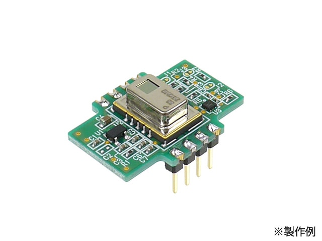
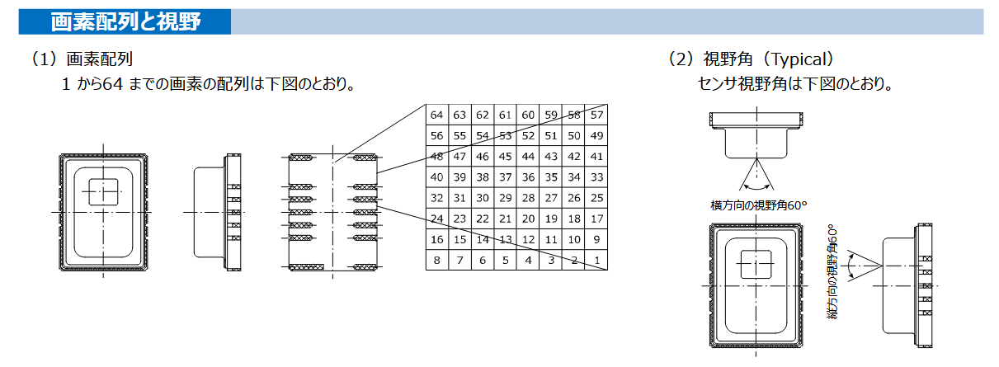
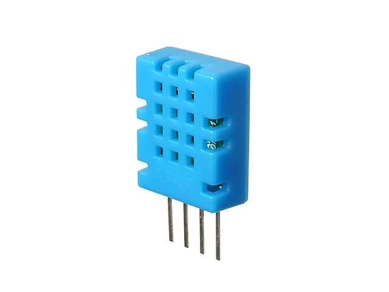
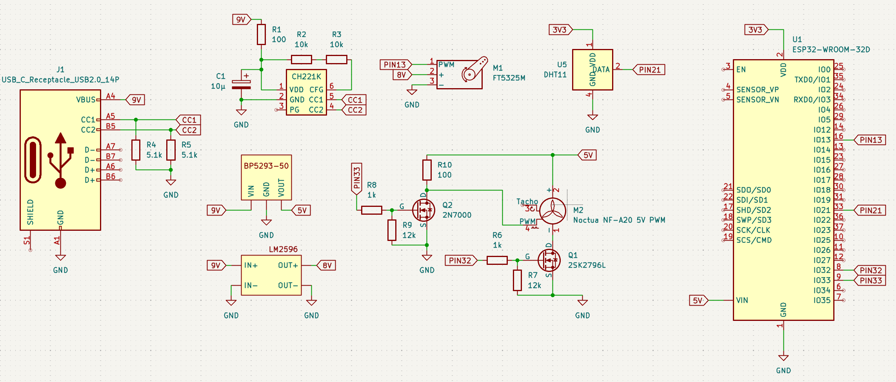
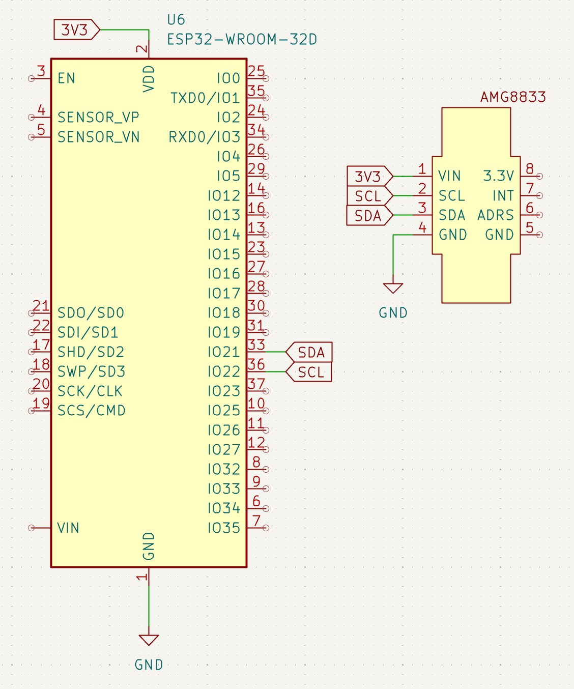
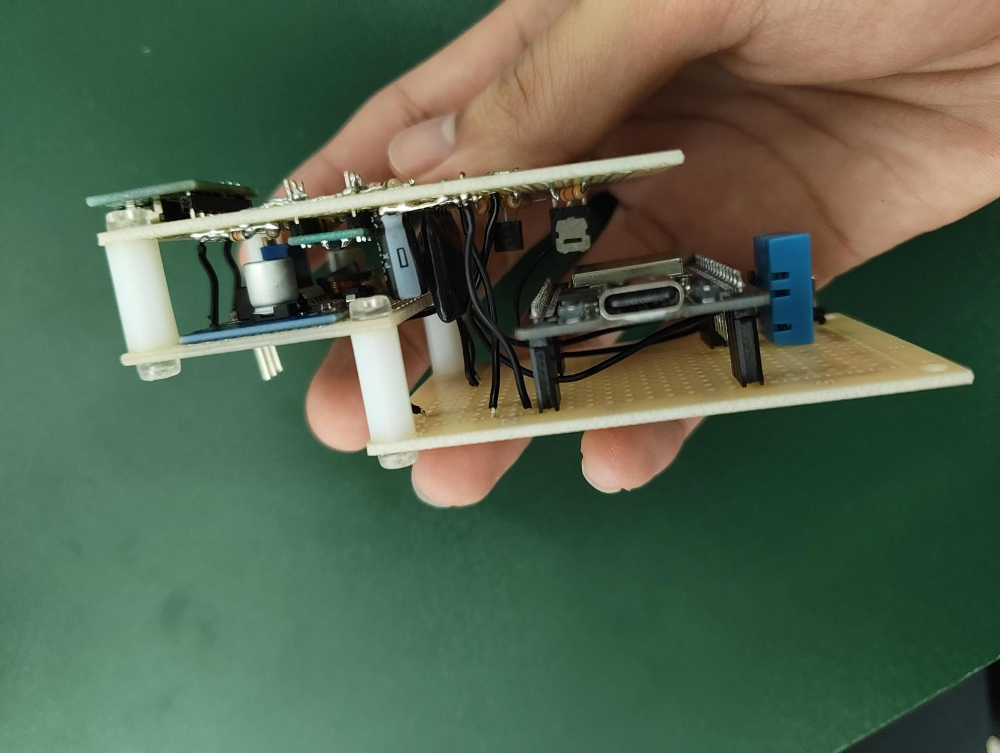
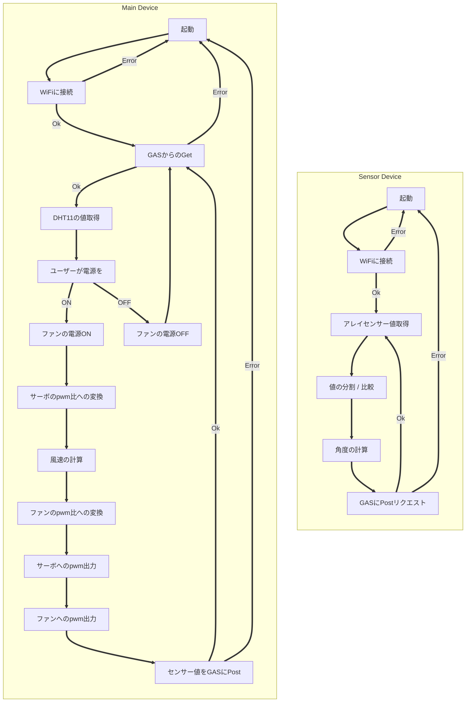
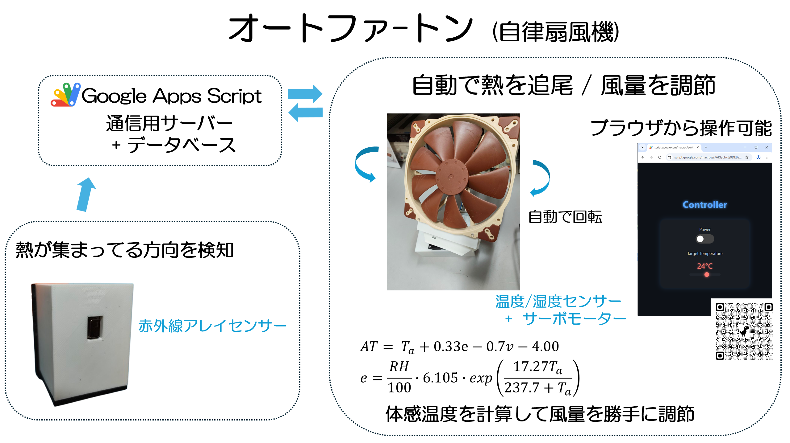

## GAS + Arduino kinda IOT Project
I'm making automatic controled fan that turns towards the hottest direction(assuming Human).

The fun's speeed is adjusted by caluculated Appearannce Temperature.

You can set some parameters in webpage, like targeted temperature, periodical notifications in discord.

> this is some practical assignment of my department 

### gas

Using clasp and so typescript

Gas is launching html

To deploy and see the page
> sh deploy.sh

### arduino
Trying to use esp-idf of rust

generate project->
> cargo generate esp-rs/esp-idf-template cargo

### memoranda
[GoogleSheet](https://docs.google.com/spreadsheets/d/12KPpMY7eV-cPQyw1QVUG0R_QObp-cpFYQhn_H8V2V_I/edit?gid=0#gid=0)

[See GAS codes](https://script.google.com/home/projects/1Yt5xZ93DhFCQdzscJVXwyot8o_8Z_F5k2Kss0VgZLZjdxhrT6P_gblSO/edit)

Page -> `sh deploy.sh` on gas directry

↓レポートのコピペ

 

# 1, 目的
### 電子デバイスを試行錯誤して作製する経験により,主体的に電子デバイス開発を行う能力をみにつける.

 

# 2, 原理・基礎的知見
## 2.1, 使用したセンサの概略と動作原理
## 2.1.1, 赤外線アレイセンサー
### 視野角60度の範囲を8×8ピクセルに分割して温度を取得する赤外線センサー.

[AMG8833使用 赤外線アレイセンサー(Grid-EYE)モジュール](https://akizukidenshi.com/catalog/g/g116737/)

### 使用概略としては,値を縦方向に分割し方向ごとの合計値を計算,比較して熱の集まる方向として角度(ラジアン値)を判定する.

 

## 2.1.1, 温湿度センサー
### 温度及び湿度を取得するセンサー.

[温湿度センサー モジュール DHT11](https://akizukidenshi.com/catalog/g/g107003/)

 

## 2.2, そのほか, 使用した特徴的な素子の概略と動作原理
## 2.2.1, USB PD シンクコントローラー
### type-c dip化モジュールと併せて使用し,PD規格とその給電する電力をコントロールするic. 今回のプロジェクトでは9[V]電源を得るために使用した.
[USB PD+BC シンクコントローラー CH224K](https://akizukidenshi.com/catalog/g/g118023/)

## 2.2.2, 三端子DCDCレギュレーター 5V
### 任意の電圧を5[V]に降圧する素子. esp-32などへの給電に使用.
[三端子DCDCレギュレーター 5V BP5293-50](https://akizukidenshi.com/catalog/g/g111188/)

 

# 3, 作品制作の実施概要
## 3.1, 作品名・キャッチコピー
### 作品名 「オートファ-トン」
### 全てが自律して動く卓上扇風機.

## 3.2, 制作の背景・目的
### デスクワークなどの作業では,常に同じ姿勢を保ち続けることは少なく,体の向きや位置は無意識のうちに変化する. 特に夏場,扇風機の風から体が外れてしまうもどかしさを経験した人は多いだろう. 従来の据え置き型扇風機は,一方向への送風や首振り機能によって一定範囲をカバーできるものの,それ以上の複雑な動きには対応できず,小回りが利かない.
### そこで今プロジェクトでは,使用者を自律的に追従し,常に適切な位置へ風を送り続け,さらに風量調節などの操作も自動化した卓上扇風機を開発する.

## 3.3, 想定ユーザーと利用シーン
### デスクワークをする人. 夏場ないし気温の高い日の屋内. その他, 対象が動く可能性があるが常に冷やし続けなければいけない状況.

## 3.4, 機能の概要
+ ### 人の体を検知/追尾し,風を常に当て続けてくれる
+ ### 温度と湿度,設定したターゲット体感温度から風量を自動で調節
### の2機能を備え,デバイス設定やリモコンとしての操作はすべてwebブラウザで行うことができる.
### また,部屋の温度をwebブラウザから確認することができる.

 

## 3.5, 構成要素と仕組み
## 3.5.1, 使用部品・物品
### 本体
+ ### ファン : Noctua NF-A20 5V PWM [商品ページ](https://www.google.com/url?sa=t&source=web&rct=j&opi=89978449&url=https://www.noctua.at/en/products/nf-a20-5v-pwm&ved=2ahUKEwjX-ZK-1bKRAxV21jQHHZiIA5kQFnoECAoQAQ&usg=AOvVaw1GPESjRE4aiZ-LXrDl6aob)
+ ### モーター : FEETECHサーボ FT5325M [商品ページ](https://akizukidenshi.com/catalog/g/g116310/)
+ ### マイコン : ESP32-32D N4 [製品ページ](https://www.digikey.jp/ja/products/detail/espressif-systems/ESP32-WROOM-32D-N4/9381716)
+ ### 温湿度センサー モジュール DHT11　[商品ページ](https://akizukidenshi.com/catalog/g/g107003/)
+ ### USBtype-CコネクターDIP化キット [商品ページ](https://akizukidenshi.com/catalog/g/g115426/)
+ ### USB PD シンクコントローラー CH221K　[商品ページ](https://akizukidenshi.com/catalog/g/g118022/)
+ ### 三端子DCDCレギュレーター 5V BP5293-50 [商品ページ](https://akizukidenshi.com/catalog/g/g111188/)
+ ### LM2596 DC - DC降圧コンバータモジュール [商品ページ](https://www.amazon.co.jp/%E3%83%95%E3%83%AA%E3%83%BC%E3%83%95%E3%83%A9%E3%82%A4%E3%83%B3%E3%82%B0-6%E5%80%8B-LM2596-DC-DC%E9%99%8D%E5%9C%A7%E3%82%B3%E3%83%B3%E3%83%90%E3%83%BC%E3%82%BF3-0%E3%80%9C40V%E3%80%9C1-5%E3%80%9C35V%E9%9B%BB%E6%BA%90%E9%99%8D%E5%9C%A7%E3%83%A2%E3%82%B8%E3%83%A5%E3%83%BC%E3%83%AB/dp/B07NVSVW1N/ref=sr_1_5?dib=eyJ2IjoiMSJ9.6wR1CySVqX_mQQm2a9BJPE1g_2Te2aSzLOrsmdTHK7bsE1ddAwtG-8vd-RkW0JlSjnCddnMkGzGh_QjZG-QoquI8ZnUkJ1zKb_PRDIJ07KABNEnoZGU5GO_bZxNW4ztOXBIAigyNw1PEaKK8VaWZqVU2k_hMNcwlOg7pVAYpKamZ2BlZ7beXCBwtCemmi6N5iR6kx_PAZNqBhJ8yWN6P0W-nMui0U6TJmReH4UXaCb-NYfe3MxLq39DoP4Xaz37MU691mATErpONsjchit9rPhxFYbuEhk7H4ncEyVXZfRQ.K4QqOjdWE7bXW8dWOhflOh1B_u2Qr78iPNLU7vShUkI&dib_tag=se&keywords=LM2596&qid=1765360029&sr=8-5)
+ ### カーボン抵抗 [商品ページ(例として10[kΩ]1/4[W])](https://akizukidenshi.com/catalog/g/g125103/)
  (100, 510, 1k, 5.1k, 10k, 12k[Ω]のものを使用)
+ ### 電解コンデンサー10μF50V105℃ [商品ページ](https://akizukidenshi.com/catalog/g/g117897/)
+ ### NchパワーMOSFET 60V5A 2SK2796L [商品ページ](https://akizukidenshi.com/catalog/g/g107145/)
+ ### MOSFET 2N7000 [商品ページ](https://akizukidenshi.com/catalog/g/g109723/)
+ ### ガラスコンポジット・ユニバーサル基板 [商品ページ(例として両面Dタイプ)](https://akizukidenshi.com/catalog/g/g111960/)
+ ### ピンヘッダー [商品ページ](https://akizukidenshi.com/catalog/g/g100167/)
+ ### ピンソケット [商品ページ](https://akizukidenshi.com/catalog/g/g105779/)
+ ### プラネジ [商品ページ](https://akizukidenshi.com/catalog/g/g101861/)

### センサー機
+ ### AMG8833使用 赤外線アレイセンサー(Grid-EYE)モジュール [商品ページ](https://akizukidenshi.com/catalog/g/g116737/)
+ ### マイコン : ESP32-32D N4 [製品ページ](https://www.digikey.jp/ja/products/detail/espressif-systems/ESP32-WROOM-32D-N4/9381716)
+ ### ガラスコンポジット・ユニバーサル基板 [商品ページ(例として両面Dタイプ)](https://akizukidenshi.com/catalog/g/g111960/)
+ ### ピンヘッダー [商品ページ](https://akizukidenshi.com/catalog/g/g100167/)
+ ### ピンソケット [商品ページ](https://akizukidenshi.com/catalog/g/g105779/)

 

## 3.5.2, 回路図

## 本体の回路図

## センサー機の回路図 / 実装した回路

 

## 3.5.3, システム構成図
### システム構成図

 

## 3.6, 実際の動作例

 