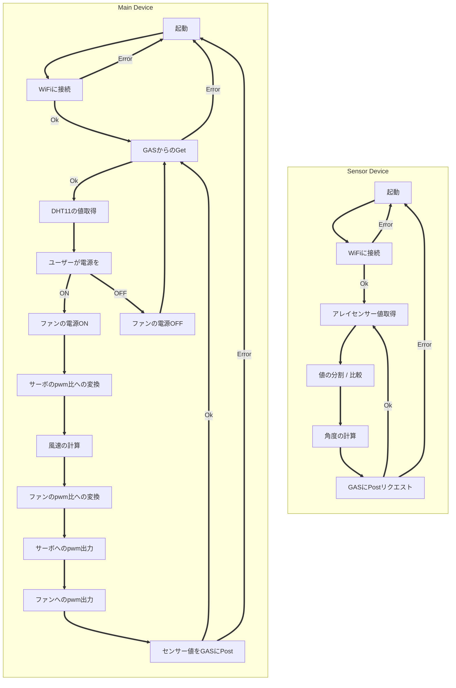

# 1, 目的
### 電子デバイスを試行錯誤して作製する経験により,主体的に電子デバイス開発を行う能力をみにつける.

 

# 2, 原理・基礎的知見
## 2.1, 使用したセンサの概略と動作原理
## 2.1.1, 赤外線アレイセンサー
### 視野角60度の範囲を8×8ピクセルに分割して温度を取得する赤外線センサー.

[AMG8833使用 赤外線アレイセンサー(Grid-EYE)モジュール](https://akizukidenshi.com/catalog/g/g116737/)

### 使用概略としては,値を縦方向に分割し方向ごとの合計値を計算,比較して熱の集まる方向として角度(ラジアン値)を判定する.

 

## 2.1.1, 温湿度センサー
### 温度及び湿度を取得するセンサー.

[温湿度センサー モジュール DHT11](https://akizukidenshi.com/catalog/g/g107003/)

 

## 2.2, そのほか, 使用した特徴的な素子の概略と動作原理
## 2.2.1, USB PD シンクコントローラー
### type-c dip化モジュールと併せて使用し,PD規格とその給電する電力をコントロールするic. 今回のプロジェクトでは9[V]電源を得るために使用した.
[USB PD+BC シンクコントローラー CH224K](https://akizukidenshi.com/catalog/g/g118023/)

## 2.2.2, 三端子DCDCレギュレーター 5V
### 任意の電圧を5[V]に降圧する素子. esp-32などへの給電に使用.
[三端子DCDCレギュレーター 5V BP5293-50](https://akizukidenshi.com/catalog/g/g111188/)

 

# 3, 作品制作の実施概要
## 3.1, 作品名・キャッチコピー
### 作品名 「オートファ-トン」
### 全てが自律して動く卓上扇風機.

## 3.2, 制作の背景・目的
### デスクワークなどの作業では,常に同じ姿勢を保ち続けることは少なく,体の向きや位置は無意識のうちに変化する. 特に夏場,扇風機の風から体が外れてしまうもどかしさを経験した人は多いだろう. 従来の据え置き型扇風機は,一方向への送風や首振り機能によって一定範囲をカバーできるものの,それ以上の複雑な動きには対応できず,小回りが利かない.
### そこで今プロジェクトでは,使用者を自律的に追従し,常に適切な位置へ風を送り続け,さらに風量調節などの操作も自動化した卓上扇風機を開発する.

## 3.3, 想定ユーザーと利用シーン
### デスクワークをする人. 夏場ないし気温の高い日の屋内. その他, 対象が動く可能性があるが常に冷やし続けなければいけない状況.

## 3.4, 機能の概要
+ ### 人の体を検知/追尾し,風を常に当て続けてくれる
+ ### 温度と湿度,設定したターゲット体感温度から風量を自動で調節
### の2機能を備え,デバイス設定やリモコンとしての操作はすべてwebブラウザで行うことができる.
### また,部屋の温度をwebブラウザから確認することができる.

 

## 3.5, 構成要素と仕組み
## 3.5.1, 使用部品・物品
### 本体
+ ### ファン : Noctua NF-A20 5V PWM [商品ページ](https://www.google.com/url?sa=t&source=web&rct=j&opi=89978449&url=https://www.noctua.at/en/products/nf-a20-5v-pwm&ved=2ahUKEwjX-ZK-1bKRAxV21jQHHZiIA5kQFnoECAoQAQ&usg=AOvVaw1GPESjRE4aiZ-LXrDl6aob)
+ ### モーター : FEETECHサーボ FT5325M [商品ページ](https://akizukidenshi.com/catalog/g/g116310/)
+ ### マイコン : ESP32-32D N4 [製品ページ](https://www.digikey.jp/ja/products/detail/espressif-systems/ESP32-WROOM-32D-N4/9381716)
+ ### 温湿度センサー モジュール DHT11　[商品ページ](https://akizukidenshi.com/catalog/g/g107003/)
+ ### USBtype-CコネクターDIP化キット [商品ページ](https://akizukidenshi.com/catalog/g/g115426/)
+ ### USB PD シンクコントローラー CH221K　[商品ページ](https://akizukidenshi.com/catalog/g/g118022/)
+ ### 三端子DCDCレギュレーター 5V BP5293-50 [商品ページ](https://akizukidenshi.com/catalog/g/g111188/)
+ ### LM2596 DC - DC降圧コンバータモジュール [商品ページ](https://www.amazon.co.jp/%E3%83%95%E3%83%AA%E3%83%BC%E3%83%95%E3%83%A9%E3%82%A4%E3%83%B3%E3%82%B0-6%E5%80%8B-LM2596-DC-DC%E9%99%8D%E5%9C%A7%E3%82%B3%E3%83%B3%E3%83%90%E3%83%BC%E3%82%BF3-0%E3%80%9C40V%E3%80%9C1-5%E3%80%9C35V%E9%9B%BB%E6%BA%90%E9%99%8D%E5%9C%A7%E3%83%A2%E3%82%B8%E3%83%A5%E3%83%BC%E3%83%AB/dp/B07NVSVW1N/ref=sr_1_5?dib=eyJ2IjoiMSJ9.6wR1CySVqX_mQQm2a9BJPE1g_2Te2aSzLOrsmdTHK7bsE1ddAwtG-8vd-RkW0JlSjnCddnMkGzGh_QjZG-QoquI8ZnUkJ1zKb_PRDIJ07KABNEnoZGU5GO_bZxNW4ztOXBIAigyNw1PEaKK8VaWZqVU2k_hMNcwlOg7pVAYpKamZ2BlZ7beXCBwtCemmi6N5iR6kx_PAZNqBhJ8yWN6P0W-nMui0U6TJmReH4UXaCb-NYfe3MxLq39DoP4Xaz37MU691mATErpONsjchit9rPhxFYbuEhk7H4ncEyVXZfRQ.K4QqOjdWE7bXW8dWOhflOh1B_u2Qr78iPNLU7vShUkI&dib_tag=se&keywords=LM2596&qid=1765360029&sr=8-5)
+ ### カーボン抵抗 [商品ページ(例として10[kΩ]1/4[W])](https://akizukidenshi.com/catalog/g/g125103/)
  (100, 510, 1k, 5.1k, 10k, 12k[Ω]のものを使用)
+ ### 電解コンデンサー10μF50V105℃ [商品ページ](https://akizukidenshi.com/catalog/g/g117897/)
+ ### NchパワーMOSFET 60V5A 2SK2796L [商品ページ](https://akizukidenshi.com/catalog/g/g107145/)
+ ### MOSFET 2N7000 [商品ページ](https://akizukidenshi.com/catalog/g/g109723/)
+ ### ガラスコンポジット・ユニバーサル基板 [商品ページ(例として両面Dタイプ)](https://akizukidenshi.com/catalog/g/g111960/)
+ ### ピンヘッダー [商品ページ](https://akizukidenshi.com/catalog/g/g100167/)
+ ### ピンソケット [商品ページ](https://akizukidenshi.com/catalog/g/g105779/)
+ ### プラネジ [商品ページ](https://akizukidenshi.com/catalog/g/g101861/)

### センサー機
+ ### AMG8833使用 赤外線アレイセンサー(Grid-EYE)モジュール [商品ページ](https://akizukidenshi.com/catalog/g/g116737/)
+ ### マイコン : ESP32-32D N4 [製品ページ](https://www.digikey.jp/ja/products/detail/espressif-systems/ESP32-WROOM-32D-N4/9381716)
+ ### ガラスコンポジット・ユニバーサル基板 [商品ページ(例として両面Dタイプ)](https://akizukidenshi.com/catalog/g/g111960/)
+ ### ピンヘッダー [商品ページ](https://akizukidenshi.com/catalog/g/g100167/)
+ ### ピンソケット [商品ページ](https://akizukidenshi.com/catalog/g/g105779/)

 

## 3.5.2, 回路図

## 本体の回路図

## センサー機の回路図 / 実装した回路

 

## 3.5.3, システム構成図
### システム構成図

 

## 3.6, 実際の動作例

 

## 3.7, 工夫点・特徴
+ ### 回路の実装をできる限りコンパクトに収めた.
+ ### GASを通して,webアプリを作成した.
+ ### type-cを通す穴やサーボモーター,ファンを固定できる駆体の設計をした.
+ ### ファンの電源に対するスイッチ回路を組んだ.
+ ### モーター/ファン等の,電源に要求される電圧値が異なる物品を動かすために回路の電源部分とそこに降圧回路を二か所用意した. 一つについてはicを使用して降圧回路を組んだがこれは流れる電流が回路内のインダクタの定格を超えて発振したために失敗.

 

## 3.8, 今後の改良点・応用の可能性
## 3.8.1, 未達成の項目
### 1, 本体側プログラムのwifi処理(http通信のGet)がエラーを吐いており,http通信用に定義されたstructがエラーを持った状態で使いまわされるため二回目のGet通信でパニックを起こす.そのため,プログラム再起動分のラグ10秒前後がモーターの動作に生まれ,連続して動かない.
### 2, ファン部分のカバーを作り切れていない. またそのためファンの出力する風量の定義があいまいで,風速の計算が正確に定まっていない.
### 3, 体感温度の計算ロジックとファンの速度変更についてどちらも動作確認ができていない.

## 3.8.2, 改良点
+ ### 本体の駆体について,ファンや回路,駆体などを総じて軽量化/安価化し設置できる場所を壁などまで増やす.
+ ### webアプリから見ることができるデータを増やす(例: ファン本体の動作モデルなど).

## 3.8.2, 展望
+ ### 赤外線アレイセンサーについて,かなり高い精度で人のいる方向を検知することができた. この正確性をもつセンサーと熱の方向のロジックは扇風機に関係なく実装でき、色々な応用が利く可能性がある.
+ ### プログラムのデバッグをして,本体を想定通りに動かす.
+ ### 回路,駆体の再設計とデザイン性の考慮をし,さらにコンパクトにする.
+ ### ファンのカバーを風の通りなども考えて設計し,またプログラムの体感温度計算ロジック,回路のファンへの信号線増幅部分を見直してな直す. 
+ ### 場合によってはコンピュータ部分のスペックを上げ,カメラを用いた画像処理を行って精度を上げる.([これからの展望について](#4211-これからの展望について))
+ ### webアプリを改良し,UI/UXを改善する,実用的な機能を追加する.([アプリが使いづらいのでは](#4212-アプリが使いづらいのでは))

 

# 4, ユーザーレビュー
## ~~4.1, 文化祭での展示・意見募集の結果~~
貰えていないため割愛.

 

## 4.2, ピアレビュー結果
## 4.2.1, ピアレビューで寄せられた質問・コメント,それに対する回答
### 4.2.1.1, これからの展望について
### &ensp;回答: 場合によってはコンピュータ部分のスペックを上げ,カメラを用いた画像処理を行って精度を上げるかもしれないです.
### 4.2.1.2, アプリが使いづらいのでは
### &ensp;回答: 改良するつもりです.
### 4.2.1.3, 風速の調整の方法
### &ensp;回答: Australian Appearant Temperature Formulaというものを風速について解いて,プログラムに実装しています. &ensp;ユーザーがアプリからターゲットの体感温度を設定したら風速が求まる仕組みです.
### 4.2.1.4, センサーを本体に取り付けてもいいのでは
### &ensp;回答: センサーの範囲の問題で扇風機と使用者が近くなければ有用でかつ色々な障壁が取り除かれるからありだと思う. ただセンサー部分の取り回しは悪くなる.

 

## 4.2.2, ピアレビューで行った質問・コメント,それに対する回答
### 4.2.2.1, 温度計の精度はどのくらい良いですか`4番に対して`
### &ensp;回答: 制度はかなり高いが,対象をぴったりくっつけないと反応しないという制約がある.
### 4.2.2.2, 通知等で使用者は目が覚めますか`8番に対して`
### &ensp;回答: データは,記録して寝ている時間等を解析するためのもので特にありません.
### &ensp;質問2: クッションのようにしたらいいのでは.
### 4.2.2.3, カーテンの開閉をできるようにしたらいいのでは`16番に対して`
### &ensp;回答: ありだと思う.

 

## 4.2.3, クラスメイトの作品を見て,今後の自分の制作に活かせるなと思った点
### 作品としては,デザインと第一印象がいかに大事かということを感じた.
### カメの水槽の水温を測っていたり,ノートPCの充電を自動化していたり,身の回りの物からシンプルだが面白いようなアイデアをたくさん見れて,何かを思いつくという上で,いい経験になったと思う.

 

## 4.3, 考察・レスポンス
### まだ動いていない部分を完成させて,制作物として完璧な状態にしたい.

 

# 5, 感想・考察
### 今回のプロジェクト/実習では,電子工作自体がほとんど初めてで分からない部分と格闘しながらであったが,部品や素子,センサーの選定,回路の設計,動作確認など一連の制作の流れを通して,アイデアをちょっとずつ形にして行けたことはとても面白かった.
### かなり楽しい経験であったし,新しいことに挑戦する機会にもなったのでこの経験をこれからに生かしていきたい.

 

# 7, 参考文献
(1) The Bureau of Meteorology. (5/2/2010). Thermal Comfort observations.[Government's Announcement]. [http://www.bom.gov.au/info/thermal_stress/#atapproximation](http://www.bom.gov.au/info/thermal_stress/#atapproximation)

 

# 8, 備考
+ [リポジトリ](https://github.com/peluviini/GakkaNoKadai)